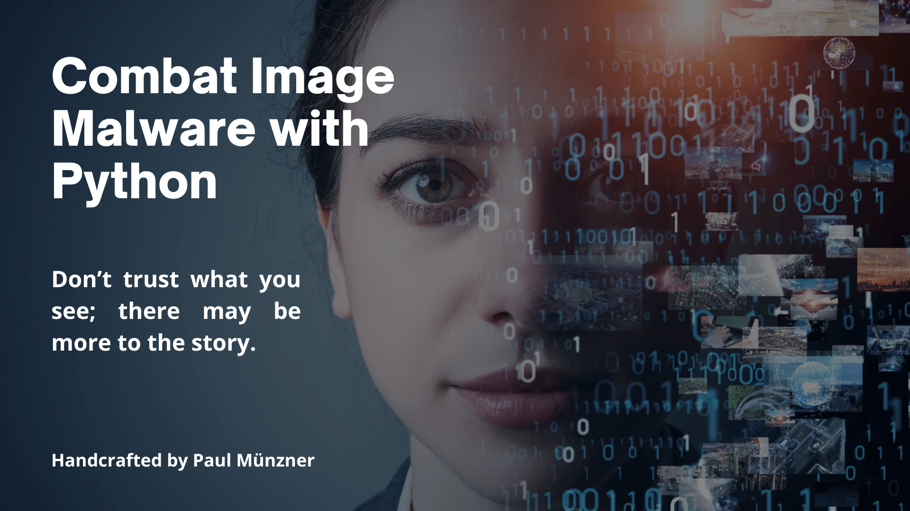
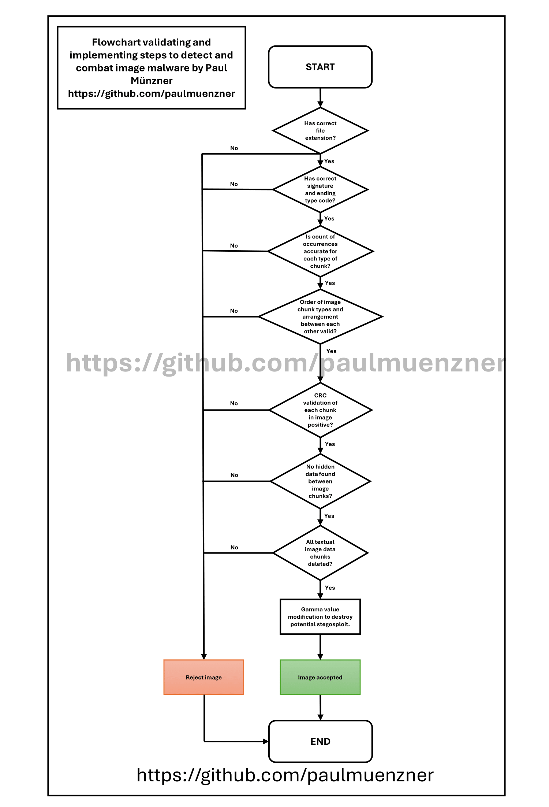

<!-- PROJECT SHIELDS -->
<!--
*** https://www.markdownguide.org/basic-syntax/#reference-style-links
-->

[![Issues][issues-shield]][issues-url]

[![GNU License][license-shield]][license-url]
[![paulmuenzner github][github-shield]][github-url] 
[![Contributors][contributors-shield]][contributors-url]
 <!-- [![paulmuenzner.com][website-shield]][website-url] -->

<!-- PROJECT LOGO -->
 

  

  <h3 align="center">Image Malware Detection and Sanitization</h3>

  

    Stegosploit - Hidden Code - Structure Validation
     
    <a href="#about-the-project"><strong>EXPLORE DOCS</strong></a>
     
     
    <a href="https://github.com/paulmuenzner/image-malware-detection-and-sanitization/issues">Request Feature</a>
    ·
    <a href="https://github.com/paulmuenzner/image-malware-detection-and-sanitization/issues">Report Bug</a>
  

<!-- HEADER -->

<!-- ABOUT THE PROJECT -->
## About The Project

In today's rapidly evolving digital landscape, the exchange and download of images have become an integral part of our online experience. From social media platforms to web content, images are shared and downloaded at an unprecedented rate. However, amidst this convenience and visual richness, there exists a subtle and often overlooked danger – the hidden risks concealed within seemingly harmless images.

This Python software project is designed to detect and sanitize malware within PNG images. Malicious code embedded in images can pose a serious threat. This software project aims to provide a robust solution for identifying and cleaning such threats. It is currently in the development phase, with ongoing efforts to enhance its capabilities.

**Current Features:**

-   The current version includes file extension validation, which serves as a foundational security measure.
-   Signature and ending type validation for PNG images.
-   Count validation of the occurrence of each chunk type.
-   Verification of the order and arrangement of chunks relative to each other.

**Development Phase:**

Planned code sections include additional PNG analysis features to cover various ways in which malicious code can be hidden. This encompasses 
-   CRC validations, 
-   validation of space between PNG chunks (as code can be concealed there), 
-   sanitation methods such as deleting textual chunks (tEXt, zTXt, iTXt). 
-   Another planned sanitation measure involves conducting gamma modification to thwart potential stegosploit implementations.

**Note on Animation Chunks:**
The usage of animation chunks like acTL (Animation Control Table) and fcTL (Frame Control) or fdAT in PNG files is relatively uncommon. PNG primarily serves as a format for lossless static images, and other formats like GIF are more widely used for animations.

## Purpose

Many users, while enjoying the visual content, may not be fully aware of the potential threats lurking beneath the surface. Malicious actors take advantage of the unsuspecting nature of users, exploiting the widespread use of images as a vector for cyber threats. These actors employ sophisticated techniques to embed harmful code within images.

The goal of these malicious activities is to compromise systems and gain unauthorized access to sensitive information. By incorporating malicious code within an image file, attackers can exploit vulnerabilities in software, execute unauthorized commands, or facilitate the distribution of malware. The very images we share, download, and interact with on a daily basis may harbor concealed dangers that can lead to significant cybersecurity breaches.

This digital era demands heightened awareness and vigilance among users to recognize the potential risks associated with seemingly innocuous images. As technology advances, so do the methods employed by cybercriminals, making it crucial for users to understand and mitigate these risks. This Python project, with its focus on image malware detection and sanitization, plays a pivotal role in addressing these challenges by providing users with a tool to safeguard against hidden threats in their digital visual content.

<!-- Representation -->
## Use Cases

1. **Web Security:**
   - Preventing malicious PNG images from being uploaded to websites, protecting users from potential exploits.

2. **Email Security:**
   - Scanning and sanitizing PNG attachments in emails to block malware and enhance overall email security.

3. **Content Management Systems (CMS):**
   - Integrating malware detection to ensure that PNG images uploaded to CMS platforms do not contain harmful code.

4. **Digital Forensics:**
   - Analyzing PNG images as part of digital forensics investigations to identify and neutralize potential threats.

5. **Secure Image Hosting:**
   - Ensuring that PNG images hosted on platforms are free from malware, creating a secure environment for users.

6. **Social Media Security:**
   - Implementing checks to verify the integrity of PNG images shared on social media platforms to prevent the spread of malicious content.

7. **Endpoint Security:**
   - Detecting and removing malware embedded in PNG images to secure individual devices and endpoints.

8. **E-commerce Platforms:**
   - Safeguarding e-commerce platforms by scanning product images to prevent the distribution of malware.

9. **Threat Intelligence:**
   - Providing valuable threat intelligence by analyzing patterns and characteristics of PNG malware for broader security awareness.

10. **Mobile App Security:**
    - Verifying PNG images used in mobile applications to prevent potential security vulnerabilities.

11. **Cloud Storage Security:**
    - Integrating with cloud storage services to ensure that PNG images stored in the cloud are free from malware.

12. **Government and Defense:**
    - Employing PNG image malware detection for secure communication and information sharing within government and defense sectors.

13. **Educational Platforms:**
    - Protecting educational resources by scanning PNG images used in online courses and educational materials.

14. **Software Development Repositories:**
    - Scanning PNG images within code repositories to maintain the integrity and security of software projects.

15. **Embedded Systems Security:**
    - Verifying PNG images used in embedded systems to prevent potential security risks in IoT devices and other embedded applications.

<!-- ROADMAP -->
## Roadmap

-   ✅ Validate file extension (even if very low significance)
-   ✅ Validate if likely malicious excess code before signature or behind IEND positioned
-   ✅ Validate accurate number of permitted chunks in png
-   ✅ Validation arrangement and order of png chunks 
-   ⬜️ Conduct CRC validation for each appearing png chunk
-   ⬜️ Validate correct length of png chunks appearing
-   ⬜️ Validate space between png chunks
-   ⬜️ As precaution, remove tEXt, zTXt and iTXt chunks from image (potential malware source)
-   ⬜️ Conduct gamma modification destroying potential stegosploit cases
-   ⬜️ Add feature for other file types such as JPEG, SVG, WebP or GIF

<!-- CONTRIBUTING -->
## Contributing

Contributions are what make the open source community such an amazing place to learn, inspire, and create. Any contributions you make are **greatly appreciated**.

Contributions are more than welcome! See [CONTRIBUTING.md](CONTRIBUTING.md) for
more info.

(<a href="#readme-top">back to top</a>)

<!-- LICENSE -->
## License

Distributed under the GNU General Public License v2.0. See [LICENSE](LICENSE.txt) for more information.

(<a href="#readme-top">back to top</a>)

<!-- CONTACT -->
## Contact

Paul Münzner: [https://paulmuenzner.com](https://paulmuenzner.com) 

Project Link: [https://github.com/paulmuenzner/image-malware-detection-and-sanitization](https://github.com/paulmuenzner/image-malware-detection-and-sanitization)

(<a href="#readme-top">back to top</a>)

<!-- MARKDOWN LINKS & IMAGES -->
<!-- https://www.markdownguide.org/basic-syntax/#reference-style-links -->
[license-shield]: https://img.shields.io/badge/license-GPL_2.0-orange.svg?colorB=FF5733
[license-url]: https://github.com/paulmuenzner/image-malware-detection-and-sanitization/blob/master/LICENSE.txt
[issues-shield]: https://img.shields.io/github/issues/paulmuenzner/image-malware-detection-and-sanitization.svg
[issues-url]: https://github.com/paulmuenzner/image-malware-detection-and-sanitization/issues
[github-shield]: https://img.shields.io/badge/paulmuenzner-black.svg?logo=github&logoColor=ffffff&colorB=000000
[github-url]: https://github.com/paulmuenzner?tab=repositories
[contributors-shield]: https://img.shields.io/github/contributors/paulmuenzner/image-malware-detection-and-sanitization.svg
[contributors-url]: https://github.com/paulmuenzner/image-malware-detection-and-sanitization/graphs/contributors